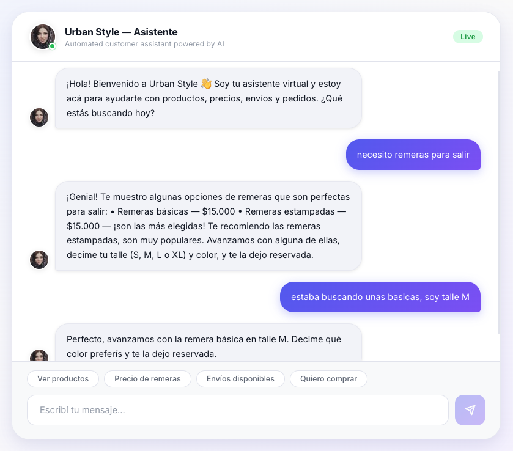

## 🚀 Gracias por comprar

Este proyecto incluye:
- versión starter
- versión final
- prompt optimizado

Recomendación:
Primero mirá el video y después explorá el código.

# AI Sales Chatbot — React + OpenAI

Este proyecto muestra cómo crear un asistente de ventas con IA que responde clientes automáticamente como si fuera un negocio real.

En pocos pasos vas a tener un asistente capaz de responder consultas, mostrar productos y guiar a una compra usando React y la API de OpenAI.

---

## 🖼️ Demo



---

## 💡 ¿Para qué sirve?

Con este proyecto podés:

- Automatizar respuestas a clientes
- Crear demos para vender soluciones con IA
- Integrarlo en una web o e-commerce
- Entender cómo funcionan los asistentes de ventas

---

## 📁 Estructura

```
ai-sales-chatbot/
├── starter/   → versión base para seguir el curso paso a paso
├── final/     → versión completa y funcionando
└── README.md
```

---

## 🚀 Cómo empezar

```bash
# 1. Clonar el repositorio
git clone <url-del-repo>

# 2. Ir a la carpeta starter
cd starter

# 3. Instalar dependencias
npm install

# 4. Iniciar el servidor de desarrollo
npm run dev
```

Luego seguí el curso para implementar la integración con OpenAI paso a paso.

---

## 🔑 API Key (solo para /final)

Creá un archivo `.env` dentro de la carpeta `final/`:

```
VITE_OPENAI_API_KEY=tu_api_key_aqui
```

Podés obtener tu API key en https://platform.openai.com/api-keys.

---

## 🧱 Stack

- React 18 — UI del chatbot
- Vite — bundler y dev server
- OpenAI API — modelo `gpt-4o-mini`

---

## ⚠️ Nota

Este proyecto es solo educativo. La API key queda expuesta en el frontend, lo cual no es seguro para producción. En un proyecto real se usa un backend como intermediario.